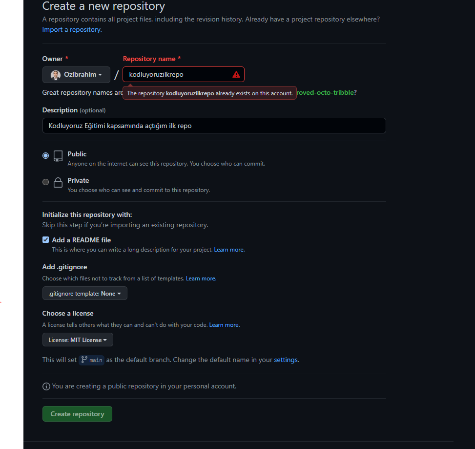

# kodluyoruzilkrepo
Bu repo Kodluyoruz Front-End Eğitiminde oluşturduğumuz ilk repo. İçerisinde bir adet README dosyası, bir adet de index.html barındırıyor.



## Installation
Öncelikli projeyi clonelayın (https://github.com/Ozibrahim/kodluyoruzilkrepo.git)
```
git clone https://github.com/Ozibrahim/kodluyoruzilkrepo.git
````

## Usage

Projeyi cloneladıktan sonra Visual Studio Code programnda açınız

Linux için:

```
cd kodluyoruzilkrep
code .
```
## Contributing
pull requestler kabul edilir. Büyük değişiklikler için, lütfen önce neyi değiştirmek istediğinizi tartışmak için bir konu açınız

## license

[**MIT**](https://choosealicense.com/licenses/mit/)